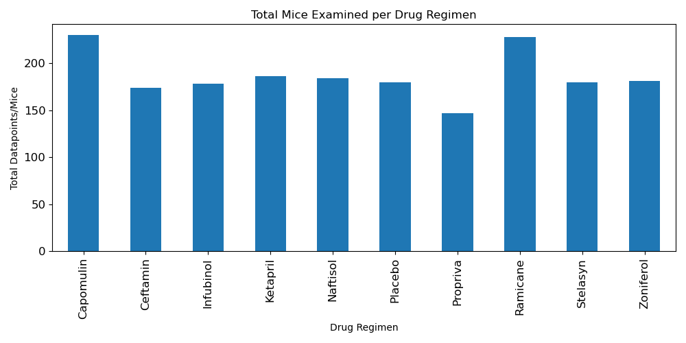
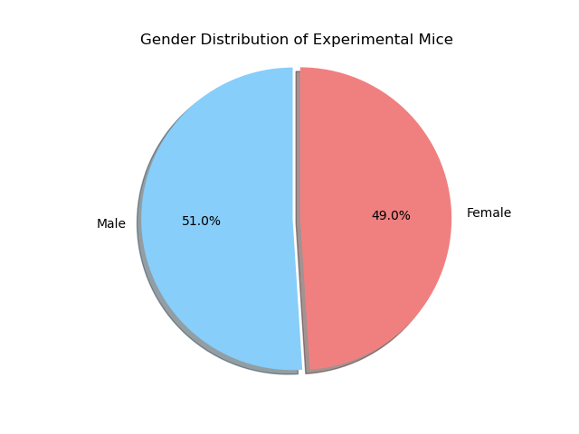
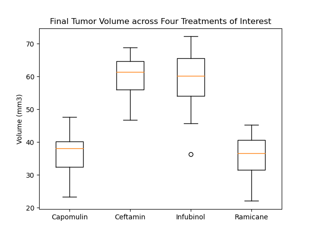
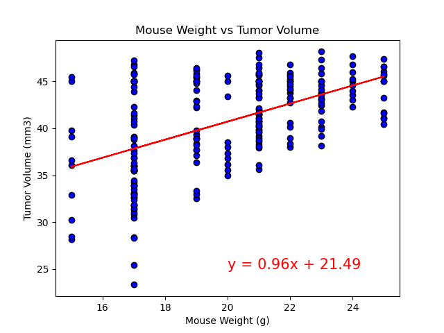
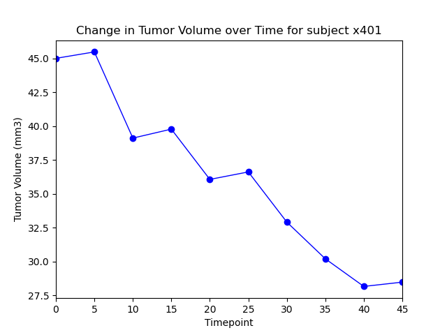

# Pymaceuticals_Matplotlib
Analyzed treatment protocols for squamous cell carcinoma in mice. Determined which treatements show greater promise and are most viable for further study.
One of the key metrics used was the change in tumor mass/volume.

Excerpts of visualized data:

